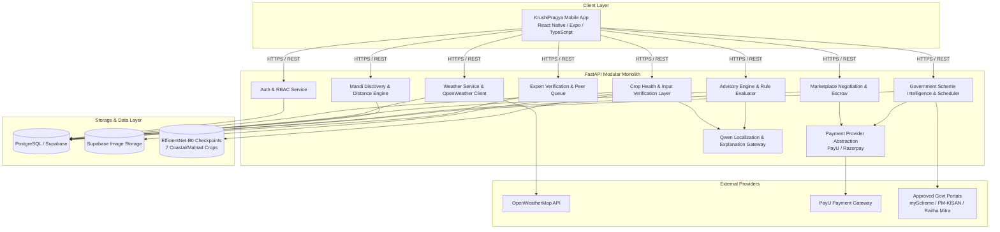
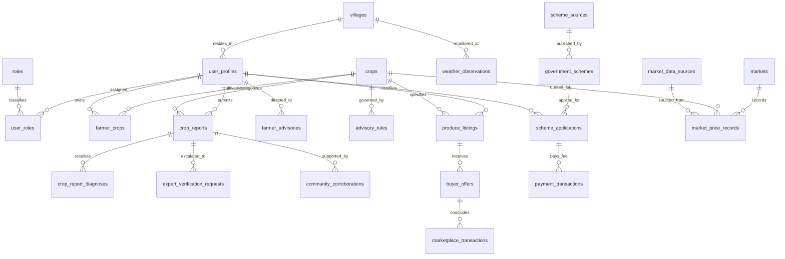

# KrushiPragya (ಕೃಷಿಪ್ರಜ್ಞೆ)

> **An AI-Powered Agriculture Intelligence Network for Coastal & Malnad Karnataka**  
> *Connecting Farmers, Agricultural Scientists, Government Officers, Produce Buyers, and Rural Communities.*

---

## 1. Executive Summary & Problem Statement

Agriculture in the **Coastal and Malnad regions of Karnataka** (covering districts such as Dakshina Kannada, Udupi, Uttara Kannada, Shivamogga, Chikkamagaluru, and Kodagu) presents distinct agronomic realities:
- **High-Humidity Microclimates & Heavy Rainfall:** Torrential monsoons trigger rapid fungal and phytoplasma epidemics (e.g., Koleroga/Mahali fruit rot in Arecanut, Quick Wilt in Black Pepper, Yellow Leaf Disease).
- **Specialized High-Value Cash & Plantation Crops:** Crops like Arecanut (*Areca catechu*), Black Pepper, Cardamom, Coconut, Turmeric, Ginger, and Paddy require hyper-local crop protection and precision harvesting.
- **Fragmented Information Silos:** Farmers often face disconnected advisories, unverified WhatsApp remedies, volatile APMC mandi price arbitrage, delayed government scheme awareness, and lack of direct trade negotiation.

**KrushiPragya** is built as an **end-to-end Agriculture Intelligence Network** rather than a standalone disease detection utility. It unifies:
1. Defensive, multi-stage computer vision inference for crop health.
2. Verified, deterministic agricultural treatment metadata from ICAR institutions.
3. Coordinate-level live weather risk intelligence.
4. An authoritative Trust Ladder linking peer corroboration to certified expert verification.
5. Direct farmer-buyer produce listings with escrow/token payment flows.
6. Central and Karnataka state government scheme intelligence with assisted application workflows.

---

## 2. Core Product Architecture & Philosophy

```
  [OBSERVE]      Field photos (GPS-tagged) & live microclimate coordinates
      ↓
  [ANALYSE]      EfficientNet-B0 closed-set ML diagnosis + Weather risk metrics
      ↓
[CORROBORATE]    Community symptom corroboration (non-diagnostic field evidence)
      ↓
  [VERIFY]       Accredited Agriculture Expert clinical review & confirmation
      ↓
   [ADVISE]      Deterministic agronomic rules + Qwen Kannada localization
      ↓
    [ACT]        Farmer prophylactic spray, drainage, or cultivation action
      ↓
[TRADE / ENABLE] Direct harvest lot negotiation (Buyer) & Scheme access (Govt)
```

### The Three Authorities Principle
To protect farmers from AI hallucinations, chemical misdosages, and unverified advice, KrushiPragya enforces strict separation of concerns across the stack:

| Component | Role in KrushiPragya | Operational Rule |
| :--- | :--- | :--- |
| **PyTorch ML Models** | **Diagnosis Authority** | Closed-set EfficientNet-B0 classifiers identify visual lesions and output class probabilities. |
| **Disease Knowledge Base** | **Verified Metadata Authority** | 100% deterministic, curated guidelines from **ICAR-CPCRI**, **ICAR-IISR**, **ICAR-IIRR**, and **UAS Dharwad/Bangalore**. Never hallucinated. |
| **Rule Engine** | **Agricultural Action Authority** | Evaluates conjunctive agronomic thresholds (rainfall, humidity, temp) to produce actionable decisions. |
| **Qwen / LLM Layer** | **Explanation & Localization ONLY** | Ingests *only* approved structured facts to translate advice into natural, respectful farmer-friendly Kannada. **The LLM never diagnoses diseases or invents chemicals.** |

---

## 3. Actor Roles & Permissions (RBAC)

KrushiPragya implements a multi-tenant Role-Based Access Control model backed by Supabase Auth and PostgreSQL:

```
                      ┌──────────────────────┐
                      │    Supabase Auth     │
                      └──────────┬───────────┘
                                 │ JWT (sub UUID)
                      ┌──────────▼───────────┐
                      │    user_profiles     │
                      └──────────┬───────────┘
                                 │
                      ┌──────────▼───────────┐
                      │      user_roles      │
                      └──────────┬───────────┘
                                 │
                      ┌──────────▼───────────┐
                      │        roles         │
                      └──────────────────────┘
```

| Role Code | User Persona | Core Action | Permissions & Responsibilities |
| :--- | :--- | :---: | :--- |
| `FARMER` | Smallholder Grower / Cultivator | **ACT** | Registers crops and land size; runs AI leaf scans; requests formal expert review; tracks weather alerts; lists harvest lots; applies for state subsidies. |
| `AGRICULTURE_EXPERT` | KVK Scientist / Agronomist | **VERIFY** | Reviews unverified farmer crop reports in the triage queue; confirms or corrects diagnoses; issues official clinical prescriptions and spray timings. |
| `GOVERNMENT_OFFICER` | Department of Agriculture Official | **ENABLE** | Monitors taluk/district pest clusters; reviews subsidy applications; verifies farmer documents; issues official departmental directives. |
| `BUYER` | APMC Trader / Commission Agent / FPO | **TRADE** | Browses farmer produce lots; submits purchase bids; locks agreed prices; completes demo/escrow payments. |
| `COMMUNITY_MEMBER` | Village Node / Progressive Farmer / FPO | **CORROBORATE** | Submits local field symptom observations; corroborates visible disease spreads without diagnostic authority. |

---

## 4. System Architecture



---

## 5. Subsystem Implementation Details

### 5.1 Crop Health & AI Disease Detection
- **Supported Crops (7 Coastal & Malnad Commodities):**
  1. Arecanut (*Areca catechu*)
  2. Paddy (*Oryza sativa*)
  3. Coconut (*Cocos nucifera*)
  4. Black Pepper (*Piper nigrum*)
  5. Cardamom (*Elettaria cardamomum*)
  6. Turmeric (*Curcuma longa*)
  7. Ginger (*Zingiber officinale*)
- **Input Verification Gate (Pre-Inference Defense):**
  - EfficientNet-B0 is a closed-set classifier; feeding arbitrary photos (human faces, soil, tractor tires) produces false high-confidence predictions. KrushiPragya runs a **5-stage defensive pipeline** before PyTorch inference:
    1. *Payload Inspection:* MIME/magic-bytes check, file size limit ($\le 10\text{ MB}$).
    2. *Dimension Sanity:* Minimum $128 \times 128\text{ px}$, maximum aspect ratio $8.0$.
    3. *Quality Checks:* Laplacian blur variance ($\ge 12.0$), brightness window ($22.0 - 238.0$).
    4. *Foliage Coverage:* HSV foliar green/chlorophyll/necrosis ratio ($\ge 8\%$).
    5. *Confidence Gating:* Minimum $35\%$ threshold; predictions below this threshold are flagged as low confidence, preventing misleading automated confirmations.
- **Disease Knowledge Base:**
  - Standardized remedies, causal agents, and Kannada translations curated from **ICAR-CPCRI**, **ICAR-IISR**, and **State Agricultural Universities**.

### 5.2 Hyper-Local Weather & Advisory Engine
- **Microclimate Coordinate Ingestion:** Retrieves device GPS coordinates or village coordinates.
- **Weather Observations:** Normalized against temperature ($^\circ\text{C}$), humidity ($\%$) precipitation ($\text{mm}$), and wind speed ($\text{km/h}$). Key stored securely server-side.
- **Deterministic Rule Engine:** Conjunctive (AND) evaluation of rules against weather metrics (e.g., $\ge 48\text{h}$ continuous humidity $> 85\%$ triggers Koleroga preventative fungicide spray alerts).

### 5.3 Provenance-Aware Mandi Discovery
- **Mandi Discovery:** Computes Haversine distance from the farmer's coordinate to physical Karnataka APMC markets.
- **Price Benchmarks:** Min, Max, and Modal prices per quintal.
- **Data Provenance Transparency:** Seeded mandi datasets are explicitly marked in the database and API responses as `data_mode="DEMO_SEEDED"` and `is_seeded=True` so benchmark figures are never misrepresented as official live feeds.

### 5.4 Farmer-Buyer Produce Marketplace (Marukatte)
- **Produce Listings (`produce_listings`):** Farmers publish available harvest lots (quantity, grade, asking price, pickup location).
- **Buyer Offers (`buyer_offers`):** Verified buyers submit binding purchase bids.
- **Contact Masking:** Farmer personal phone numbers and exact village plots remain masked until an offer is formally accepted.
- **Transaction Ledger (`marketplace_transactions`):** Tracks order state (`PENDING`, `AUTHORIZED`, `PAID`, `FAILED`) and includes an `idempotency_key` to avoid duplicate billing.

### 5.5 Payment Gateway Integration (PayU & Razorpay)
- **Provider-Agnostic Abstraction:** Implemented via `PaymentProvider` interface with runtime toggle (`PAYMENT_PROVIDER=payu` or `PAYMENT_PROVIDER=razorpay`).
- **PayU Hosted Checkout:**
  - Generates authoritative merchant SHA-512 hashes server-side (`sha512(key|txnid|amount|productinfo|firstname|email|...|salt)`).
  - Handles auto-submitting POST checkout forms, redirect callbacks (`/api/v1/schemes/payments/payu-callback`), and server-side verification.
  - Merchant Salt is strictly server-side and never exposed to mobile clients.

### 5.6 Accredited Expert Verification
- **Audit-Linked Workflow:**
  $$\text{Crop Report} \longrightarrow \text{Request Verification} \longrightarrow \text{Payment Fee} \longrightarrow \text{Expert Queue} \longrightarrow \text{Clinical Review} \longrightarrow \text{Verified Finding}$$
- **Integrity Guarantee:** The review links directly to `crop_reports.id` via foreign key; it updates the existing diagnostic record rather than creating disconnected duplicate entities.

### 5.7 Government Schemes Intelligence
- **Allowlisted Ingestion:** Curated sources from `myScheme.gov.in`, `pmkisan.gov.in`, and Karnataka Agriculture Department (`raitamitra.karnataka.gov.in`).
- **Background Scheduler:** Managed by `SchemeScheduler` running background evaluations without blocking web workers.
- **Assisted Applications:** Tracks application progress (`SUBMITTED`, `UNDER_REVIEW`, `APPROVED`) and payment receipts.

### 5.8 Community Surveillance & Corroboration
- **Peer Symptom Verification:** Local growers corroborate observations (`SAME_SYMPTOMS`, `SEEN_NEARBY`, `NOT_MATCHING`) to build early-warning clusters for agricultural officers.
- **Authority Constraint:** Community inputs are strictly tagged as field evidence and do not possess diagnostic authority.

---

## 6. The KrushiPragya Trust Ladder

```
[Level 1: AI Analysed]
    │  • Image passes 5-stage Input Verification
    │  • EfficientNet-B0 inference (Confidence >= 35%)
    │  • Advisory generated from deterministic Knowledge Base
    ▼
[Level 2: Community Corroborated]
    │  • Local cluster farmers corroborate visible field symptoms
    │  • Builds geographic early warning score for taluk officers
    ▼
[Level 3: Expert Verified]
       • Accredited ICAR/KVK scientist conducts clinical review
       • Final diagnosis & authorized prescription recorded
```

---

## 7. Database Entity-Relationship Architecture



---

## 8. Technology Stack

### Mobile Frontend
- **Framework:** React Native (v0.76+) with Expo SDK 52
- **Language:** TypeScript 5.3+ (Strict Mode, 0 compile errors via `tsc --noEmit`)
- **Navigation:** React Navigation v7 (Native Stack & Bottom Tabs)
- **Icons & Styling:** Lucide React Native, Custom KrushiPragya Emerald Design System
- **State & Storage:** Context API (`AuthContext`, `LanguageContext`, `ReportContext`), AsyncStorage

### Backend API
- **Framework:** FastAPI (Python 3.10+)
- **ORM & Migrations:** SQLAlchemy 2.0 (Mapped Columns), Alembic
- **Validation:** Pydantic v2 Settings & Models
- **Security:** HTTPBearer, Supabase JWT Decoder (HS256), SHA-512 HMAC signatures
- **Background Tasks:** Asyncio Task Orchestration, Native Lifespan Management

### Machine Learning & AI
- **Vision Model:** PyTorch (Torchvision), EfficientNet-B0 Transfer Learning
- **Input Verification:** NumPy, Pillow, Torch Laplacian Convolution Kernels
- **Knowledge Translation:** Qwen 8B parameter model via local Ollama or Groq API (strictly bounded for Kannada localization)

### Cloud & Database Infrastructure
- **Relational Database:** PostgreSQL 15+ (Hosted on Supabase)
- **Object Storage:** Supabase Storage (`crop-report-images`)
- **External APIs:** OpenWeatherMap API, PayU Payment Gateway

---

## 9. Repository Structure

```
KrushiPragya/
├── requirements.txt                         # Top-level dependencies
├── ml/                                      # ML training & model artifact definitions
│
├── krushipragya_backend/                    # FastAPI Backend Service
│   ├── alembic/                             # Database migration scripts
│   │   └── versions/                        # 15 migration versions
│   ├── app/
│   │   ├── api/v1/                          # REST API Routers
│   │   │   ├── auth.py                      # Authentication & Profile setup
│   │   │   ├── crop_report.py               # Crop scanning & submission
│   │   │   ├── crop_report_diagnosis.py     # Diagnostic lookups
│   │   │   ├── disease.py                   # Direct CV disease inference
│   │   │   ├── farmer.py                    # Farmer profile operations
│   │   │   ├── farmer_advisory.py           # Dynamic farmer advisories
│   │   │   ├── farmer_crop.py               # Registered crops
│   │   │   ├── health.py                    # Health & readiness probes
│   │   │   ├── verification.py              # Expert queue & corroborations
│   │   │   └── weather.py                   # Coordinate & village weather
│   │   ├── core/                            # Configuration, Auth & Logging
│   │   ├── database/                        # Engine & session management
│   │   ├── market/                          # Mandi discovery & APMC models
│   │   ├── models/                          # SQLAlchemy database entities
│   │   ├── schemas/                         # Pydantic request/response models
│   │   ├── schemes/                         # Government scheme intelligence & PayU
│   │   └── services/                        # Business logic & ML inference
│   └── tests/                               # Pytest test suite (40 modules)
│
└── krushipragya_frontend/                   # React Native / Expo Application
    ├── assets/                              # App branding, crops & illustrations
    ├── src/
    │   ├── components/                      # Common, advisory, market & scheme widgets
    │   ├── constants/                       # Theme tokens & seed benchmarks
    │   ├── context/                         # Auth, Language & Report state
    │   ├── navigation/                      # RootNavigator & role-based bottom tabs
    │   ├── screens/
    │   │   ├── advisory/                    # Comprehensive crop advisory
    │   │   ├── auth/                        # Splash, Language, Onboarding, Role Setup
    │   │   ├── buyer/                       # Marketplace produce, offers & transactions
    │   │   ├── community/                   # Surveillance, reports & corroboration
    │   │   ├── expert/                      # Verification queue & decision dashboard
    │   │   ├── govt/                        # Departmental insights & applications
    │   │   ├── home/                        # Dynamic Farmer Dashboard
    │   │   ├── market/                      # Mandi prices & price discovery
    │   │   ├── profile/                     # Profile & instant role switcher
    │   │   ├── report/                      # Camera, upload & AI result cards
    │   │   └── schemes/                     # Government schemes & saved bookmarking
    │   └── services/                        # Axios clients & API integrations
    ├── App.tsx                              # Application entrypoint & onboarding controller
    └── package.json                         # Node dependencies & scripts
```

---

## 10. Local Development Setup

### Prerequisites
- Python 3.10 or higher
- Node.js 18+ and npm
- PostgreSQL instance or active Supabase project
- Git

### 10.1 Backend Setup

```powershell
# Navigate to backend directory
cd D:\KrushiPragya\krushipragya_backend

# Create virtual environment
python -m venv .venv

# Activate virtual environment (Windows PowerShell)
.\.venv\Scripts\Activate.ps1

# Install dependencies
pip install -r requirements.txt

# Configure environment variables
cp .env.example .env
# Edit .env with your PostgreSQL credentials

# Execute database migrations
alembic upgrade head

# Start development server
.\.venv\Scripts\python.exe -m uvicorn app.main:app --reload --host 0.0.0.0 --port 8000
```
Backend will be available at `http://127.0.0.1:8000` (Interactive Swagger Docs at `http://127.0.0.1:8000/docs`).

### 10.2 Frontend Setup

```powershell
# Navigate to frontend directory
cd D:\KrushiPragya\krushipragya_frontend

# Install dependencies
npm install

# Verify TypeScript compilation (0 errors)
npx tsc --noEmit

# Start Expo development server
npx expo start
```
Scan the QR code with **Expo Go** on Android or press `a` to run in an active Android emulator.

---

## 11. Environment Configuration

### Backend Configuration (`krushipragya_backend/.env`)

```ini
# Application Runtime
APP_NAME=KrushiPragya
APP_VERSION=1.0.0
ENVIRONMENT=development
DEBUG=True

# Database (PostgreSQL / Supabase)
DATABASE_URL=postgresql://postgres:[PASSWORD]@[HOST]:5432/postgres
DIRECT_URL=postgresql://postgres:[PASSWORD]@[HOST]:5432/postgres

# Security & Supabase Auth
JWT_SECRET=[YOUR_SUPABASE_JWT_SECRET]
JWT_ALGORITHM=HS256

# Hyper-Local Weather
WEATHER_PROVIDER=openweather
OPENWEATHER_API_KEY=[YOUR_OPENWEATHER_API_KEY]
OPENWEATHER_BASE_URL=https://api.openweathermap.org/data/2.5

# Payment Gateway (PayU test configuration)
PAYMENT_PROVIDER=payu
PAYU_MERCHANT_KEY=[YOUR_PAYU_KEY]
PAYU_MERCHANT_SALT=[YOUR_PAYU_SALT]
PAYU_ENVIRONMENT=test

# LLM Kannada Localization Layer (Ollama or Groq)
LLM_PROVIDER=ollama
LLM_BASE_URL=http://localhost:11434
LLM_MODEL=qwen3:8b
LLM_TEMPERATURE=0.0
```

---

## 12. Key API Endpoints Reference

| Domain | Method | Endpoint | Access Role | Description |
| :--- | :---: | :--- | :---: | :--- |
| **Auth** | `POST` | `/api/v1/auth/profile-setup` | Public | Registers profile, assigns role, and sets canonical village. |
| **Auth** | `GET` | `/api/v1/auth/me` | Authenticated | Fetches active profile, assigned roles, and permissions. |
| **Disease** | `POST` | `/api/v1/disease/detect` | `FARMER` | Evaluates leaf photo through Input Verification + PyTorch model. |
| **Crop Reports** | `POST` | `/api/v1/crop-reports` | `FARMER` | Submits field scan into the persistent diagnostic ledger. |
| **Weather** | `GET` | `/api/v1/weather/current` | Public | Retrieves coordinate-based microclimate weather. |
| **Weather** | `GET` | `/api/v1/weather/villages/{id}/advisory` | Public | Runs deterministic agronomic rules for village crops. |
| **Advisories** | `GET` | `/api/v1/farmer-advisories/comprehensive` | `FARMER` | Delivers comprehensive weather, crop, and pest advisories. |
| **Mandi Market** | `GET` | `/api/v1/market/nearby` | Public | Haversine distance discovery for APMC mandi rates. |
| **Marketplace** | `POST` | `/api/v1/market/farmer/listings` | `FARMER` | Creates a produce harvest lot available for purchase. |
| **Marketplace** | `POST` | `/api/v1/market/buyers/offers` | `BUYER` | Submits purchase negotiation bid on a farmer produce lot. |
| **Payments** | `POST` | `/api/v1/market/payments/create-order` | `BUYER` | Initializes escrow payment order. |
| **Schemes** | `GET` | `/api/v1/schemes` | Public | Retrieves eligible Karnataka & Central agricultural schemes. |
| **Schemes** | `POST` | `/api/v1/schemes/payments/payu-checkout-form/{id}`| `FARMER` | Generates PayU auto-submitting checkout form. |
| **Verification** | `GET` | `/api/v1/expert/verifications` | `EXPERT` | Triage queue of pending farmer scans requiring diagnosis. |
| **Verification** | `POST` | `/api/v1/expert/verifications/{id}/decision` | `EXPERT` | Official confirmation or correction of crop diagnosis. |
| **Community** | `POST` | `/api/v1/expert/verifications/{id}/corroborate` | `COMMUNITY`| Submits non-diagnostic field symptom corroboration. |

---

## 13. Data Provenance & Safety Declarations

| Data Category | Provenance Source | Handling in KrushiPragya |
| :--- | :--- | :--- |
| **Live Microclimate Weather** | OpenWeatherMap API | Live coordinates queried on demand; cached in `weather_observations`. |
| **Mandi Price Records** | Seeded APMC Benchmarks | **Flagged as DEMO_SEEDED.** Benchmarks are based on Karnataka APMC historicals and must not be treated as live official feeds. |
| **Disease Knowledge Base** | ICAR Institutes (CPCRI, IISR, IIRR) | Curated static metadata. Deterministic dosage and chemical guidelines. |
| **AI Diagnoses** | PyTorch EfficientNet-B0 Models | Statistical inference. Requires $\ge 35\%$ confidence score. |
| **Kannada Localization** | Qwen 8B parameter model | Explanation and linguistic translation only. Never generates diagnosis. |
| **Government Schemes** | myScheme / PM-KISAN / Raitha Mitra | Ingested and indexed for eligibility matching. |

---

## 14. Testing & Verification

The project includes unit and integration tests across backend microservices:

```powershell
# Run backend pytest suite
cd D:\KrushiPragya\krushipragya_backend
.\.venv\Scripts\pytest -v

# Run frontend TypeScript validation
cd D:\KrushiPragya\krushipragya_frontend
npx tsc --noEmit
```

### Coverage Highlights
- `test_disease_production_hardening.py`: Validates input verification gates (dark, blurry, and non-foliar image rejections).
- `test_advisory_explanation.py`: Enforces that LLM localization cannot alter chemical recommendations or disease labels.
- `test_verification_ladder.py`: Asserts Trust Ladder transitions (`AI Analysed` $\rightarrow$ `Corroborated` $\rightarrow$ `Expert Verified`).
- `test_scheme_payment.py`: Validates PayU hash calculation, callback verification, and duplicate payment prevention.
- `test_market.py`: Verifies Haversine APMC distance ordering and provenance flags.

---

## 15. Implementation Status

| Feature Module | Status | Notes |
| :--- | :---: | :--- |
| **Role-Based Dashboards (5 Personas)** | **Implemented** | Farmer, Expert, Govt Officer, Buyer, Community Member. |
| **Global UI Design System** | **Implemented** | Emerald brand theme, unified navigation, and bilingual typography. |
| **AI Crop Disease Inference** | **Implemented** | PyTorch EfficientNet-B0 models loaded for 7 target crops. |
| **Input Verification Layer** | **Implemented** | Quality, blur, brightness, and foliage validation active. |
| **Dynamic Advisory Engine** | **Implemented** | Weather-driven agronomic rule evaluator active. |
| **Accredited Expert Triage Queue** | **Implemented** | Expert review linked directly to farmer reports. |
| **Community Evidence Submissions** | **Implemented** | Non-diagnostic symptom corroboration active. |
| **Government Scheme Discovery** | **Implemented** | Indexed allowlisted state & central schemes. |
| **PayU Hosted Payment Flow** | **Implemented** | Checkouts, callbacks, and server-side verification active. |
| **APMC Mandi Price Feeds** | **Demo / Seeded** | Benchmarks active; live Data.gov.in integration planned for production. |
| **Push Notifications (FCM / SMS)** | **Planned** | SMS/WhatsApp advisory alerts scheduled for next milestone. |

---

## 16. Future Roadmap

1. **Automated Satellite Soil Moisture Ingestion:** Incorporating Sentinel-2 NDRE and Copernicus soil data into the advisory engine.
2. **Offline Edge Inference:** Quantizing EfficientNet-B0 models with ONNX Runtime to execute scans directly on device without connectivity.
3. **Direct e-NAM Mandi Integration:** Transitioning from benchmark mandi datasets to authenticated live e-NAM APMC webhooks.
4. **Interactive Voice Response (IVR) in Tulu and Konkani:** Expanding audio accessibility beyond Kannada for coastal dialects.

---

## 17. License & Credits

- **Project:** KrushiPragya (ಕೃಷಿಪ್ರಜ್ಞೆ)
- **Domain:** AI-Driven Precision Agriculture & Agro-Informatics
- **Target Geography:** Coastal & Malnad Agro-Climatic Zones of Karnataka
- **Agricultural Reference Standards:** ICAR-CPCRI (Kasaragod/Vittal), ICAR-IISR (Calicut), ICAR-IIRR (Hyderabad), UAS Dharwad/Bangalore.
